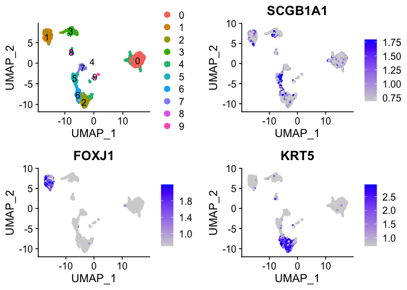
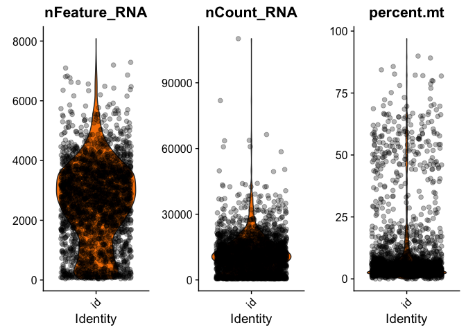

```r
library(Seurat)
library(ggplot2)
library(SoupX)
library(DropletUtils)
```

```
## Loading required package: SingleCellExperiment
```

```
## Loading required package: SummarizedExperiment
```

```
## Loading required package: GenomicRanges
```

```
## Loading required package: stats4
```

```
## Loading required package: BiocGenerics
```

```
## Loading required package: parallel
```

```
## 
## Attaching package: 'BiocGenerics'
```

```
## The following objects are masked from 'package:parallel':
## 
##     clusterApply, clusterApplyLB, clusterCall, clusterEvalQ,
##     clusterExport, clusterMap, parApply, parCapply, parLapply,
##     parLapplyLB, parRapply, parSapply, parSapplyLB
```

```
## The following objects are masked from 'package:stats':
## 
##     IQR, mad, sd, var, xtabs
```

```
## The following objects are masked from 'package:base':
## 
##     anyDuplicated, append, as.data.frame, basename, cbind, colnames,
##     dirname, do.call, duplicated, eval, evalq, Filter, Find, get, grep,
##     grepl, intersect, is.unsorted, lapply, Map, mapply, match, mget,
##     order, paste, pmax, pmax.int, pmin, pmin.int, Position, rank,
##     rbind, Reduce, rownames, sapply, setdiff, sort, table, tapply,
##     union, unique, unsplit, which, which.max, which.min
```

```
## Loading required package: S4Vectors
```

```
## 
## Attaching package: 'S4Vectors'
```

```
## The following object is masked from 'package:base':
## 
##     expand.grid
```

```
## Loading required package: IRanges
```

```
## Loading required package: GenomeInfoDb
```

```
## Loading required package: Biobase
```

```
## Welcome to Bioconductor
## 
##     Vignettes contain introductory material; view with
##     'browseVignettes()'. To cite Bioconductor, see
##     'citation("Biobase")', and for packages 'citation("pkgname")'.
```

```
## Loading required package: DelayedArray
```

```
## Loading required package: matrixStats
```

```
## 
## Attaching package: 'matrixStats'
```

```
## The following objects are masked from 'package:Biobase':
## 
##     anyMissing, rowMedians
```

```
## Loading required package: BiocParallel
```

```
## 
## Attaching package: 'DelayedArray'
```

```
## The following objects are masked from 'package:matrixStats':
## 
##     colMaxs, colMins, colRanges, rowMaxs, rowMins, rowRanges
```

```
## The following objects are masked from 'package:base':
## 
##     aperm, apply, rowsum
```

```
## 
## Attaching package: 'SummarizedExperiment'
```

```
## The following object is masked from 'package:Seurat':
## 
##     Assays
```

```r
DataDir = c('/Volumes/GC_2T/','/Volumes/GC_2T/filtered_feature_bc_matrix/',
            '/Volumes/GC_2T/desouped')
#Load 10X Data to SoupX and Seurat

sc = load10X(DataDir[1])
```

```
## Loading raw count data
```

```
## Loading cell-only count data
```

```
## Loading extra analysis data where available
```

```r
seu <- Read10X(DataDir[2])

#Run sctransform wrapper in Seurat

seu <- CreateSeuratObject(counts = seu, project = "Normal")
seu <- SCTransform(object = seu, verbose = FALSE)
seu <- RunPCA(object = seu, verbose = FALSE)
seu <- RunUMAP(object = seu, dims = 1:30,verbose = FALSE)
seu <- FindNeighbors(object = seu, dims = 1:30, verbose = FALSE)
seu <- FindClusters(object = seu, resolution = 0.5, verbose = FALSE)

#Visualize selected genes to determine if SoupX is necessary
#SCGB1A1 seems to be expressed at a high level in one cluster and at low level everywhere else, including basal and ciliated cells

DefaultAssay(seu) <- 'RNA'
p1 <- DimPlot(object = seu, label = TRUE)
p2 <- FeaturePlot(object = seu, features = c("SCGB1A1"), min.cutoff = "q10", max.cutoff = "q90")
p3 <- FeaturePlot(object = seu, features = c("FOXJ1"), min.cutoff = "q10", max.cutoff = "q90")
p4 <- FeaturePlot(object = seu, features = c("KRT5"), min.cutoff = "q10", max.cutoff = "q90")
CombinePlots(plots = list(p1,p2,p3,p4), ncol=2)
```

<!-- -->

```r
#Estimate non expressing cells

Genes = c("SCGB1A1")
seu.data <- as.data.frame(seu@reductions$umap@cell.embeddings)
seu.data$Cluster <- seu$seurat_clusters
useToEst = estimateNonExpressingCells(sc, nonExpressedGeneList = list(G = Genes), clusters = setNames(seu.data$Cluster, rownames(seu.data)))
sc = calculateContaminationFraction(sc, list(G = Genes), useToEst = useToEst)
```

```
## Estimated global contamination fraction of 4.41%
```

```r
out = adjustCounts(sc)

#Save corrected expression matrix in 10X format

write10xCounts(DataDir[3], out)

#Run sctransform wrapper in Seurat

desouped <- Read10X(DataDir[3])
seu <- CreateSeuratObject(counts = desouped, project = "Normal",min.cells = 3)
seu <- SCTransform(object = seu, verbose = FALSE)
seu <- RunPCA(object = seu, verbose = FALSE)
seu <- RunUMAP(object = seu, dims = 1:30,verbose = FALSE)
seu <- FindNeighbors(object = seu, dims = 1:30, verbose = FALSE)
seu <- FindClusters(object = seu, resolution = 0.5, verbose = FALSE)

#The expression of SCGB1A1 was corrected, but other markers were not affected

DefaultAssay(seu) <- 'RNA'
p1 <- DimPlot(object = seu, label = TRUE)
p2 <- FeaturePlot(object = seu, features = c("SCGB1A1"), min.cutoff = "q10", max.cutoff = "q90")
p3 <- FeaturePlot(object = seu, features = c("FOXJ1"), min.cutoff = "q10", max.cutoff = "q90")
p4 <- FeaturePlot(object = seu, features = c("KRT5"), min.cutoff = "q10", max.cutoff = "q90")
CombinePlots(plots = list(p1,p2,p3,p4), ncol=2)
```

<!-- -->


```r
#Filter low quality and doublet cells

seu <- PercentageFeatureSet(object = seu, pattern = "^MT-", col.name = "percent.mt")

ncells <- c(500,1000,2000,3000,4000,5000,6000,7000,8000,9000,10000)
multiplets <- c(0.4,0.8,1.6,2.3,3.1,3.9,4.6,5.4,6.1,6.9,7.6)
curva <- data.frame(multiplets,ncells)
ggplot(curva, aes(multiplets, ncells)) +
  geom_point() +
  geom_smooth(method = "lm")
```

<!-- -->

```r
fit <- lm(multiplets ~ ncells, curva)
model <- function(x){
  0.0007589*x + 0.0527214
}
Idents(seu) <- "id"
perc <- model(ncol(seu))
q = (100 - perc)/100
feature_limit <- quantile(seu$nFeature_RNA, q)
plots <-VlnPlot(object=seu,c("nFeature_RNA", "nCount_RNA", "percent.mt"), pt.size = 0, cols = "#f78000", combine =FALSE)
for(i in 1:length(plots)) {
  plots[[i]] <- plots[[i]] + geom_jitter(alpha = 0.3, colour = "black", size = 2) + theme(legend.position = 'none')
}
CombinePlots(plots,ncol = 3)
```

<!-- -->

```r
seu <- subset(seu, subset = nFeature_RNA > 200 & nFeature_RNA < feature_limit & percent.mt < 15)

plots <-VlnPlot(object=seu,c("nFeature_RNA", "nCount_RNA", "percent.mt"), pt.size = 0, cols = "#95c498", combine =FALSE)
for(i in 1:length(plots)) {
  plots[[i]] <- plots[[i]] + geom_jitter(alpha = 0.3, colour = "black", size = 2) + theme(legend.position = 'none')
}
CombinePlots(plots,ncol = 3)
```

<!-- -->


